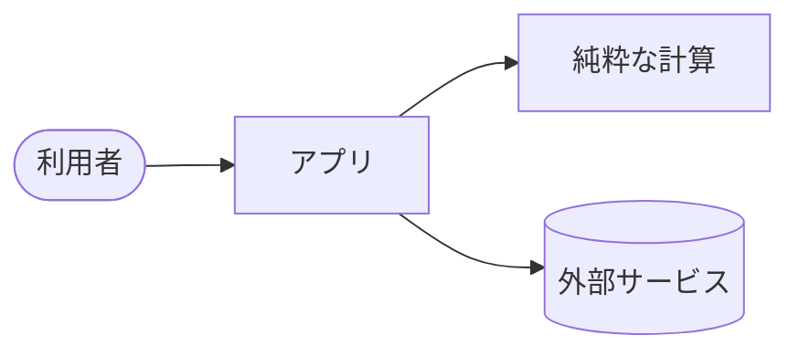
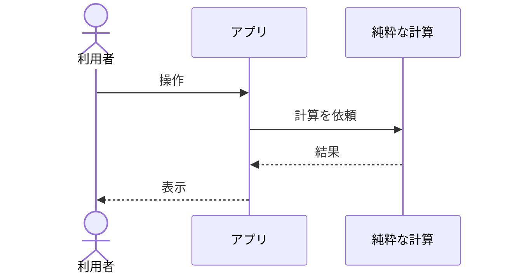

# 仕組み

<!-- 仕組みを変えた PR の中で、ここも直す。図と実装が違ったら実装が正。1 図 20 ノードまで。 -->

## 全体構成

```mermaid
flowchart LR
  user([利用者]) --> app[アプリ]
  app --> core[純粋な計算]
  app --> ext[(外部サービス)]
```

## 主要な流れ

```mermaid
sequenceDiagram
  actor U as 利用者
  participant A as アプリ
  participant C as 純粋な計算
  U->>A: 操作
  A->>C: 計算を依頼
  C-->>A: 結果
  A-->>U: 表示
```

## 共通の部品

| 部品 | 場所 | 用途 |
|---|---|---|

## そのほかの図

| 図 | ファイル |
|---|---|
